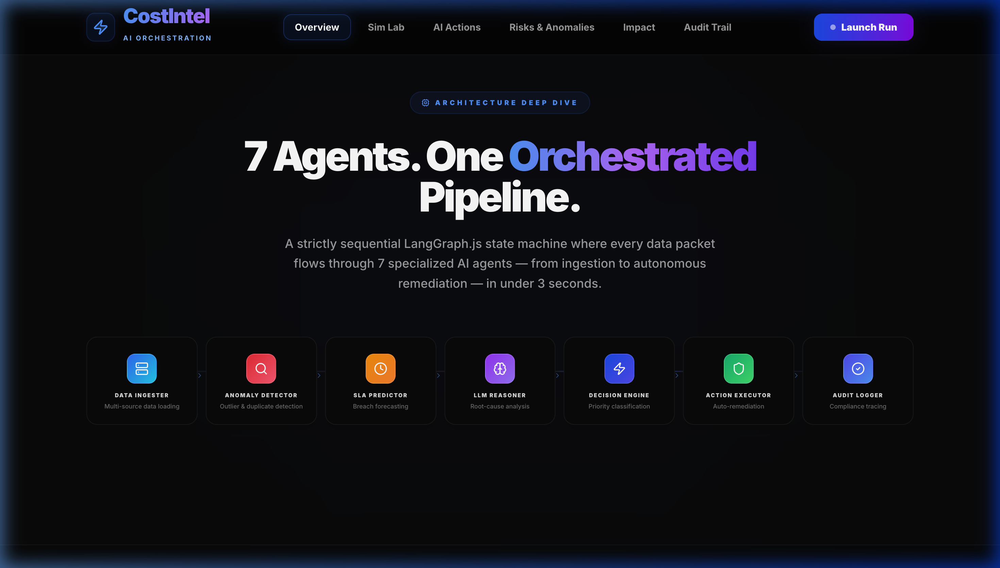

# ⚡ CostIntel — Enterprise Cost Intelligence & Autonomous Action

**A 7-agent AI pipeline that watches enterprise finances 24/7, catches cost leakage before money leaves, and acts autonomously — with a human always in the loop for high-stakes decisions.**

[](https://www.typescriptlang.org/)
[](https://nextjs.org/)
[](https://aws.amazon.com/bedrock/)
[](https://aws.amazon.com/dynamodb/)
[](https://langchain-ai.github.io/langgraphjs/)
[](LICENSE)

> **ET GenAI Hackathon 2026 — Problem Statement 3**

> 📸 **Screenshot:** Full dashboard overview showing Executive Summary with live metrics
> 

---

## 📑 Table of Contents

- [The Problem — Why This Exists](#the-problem--why-this-exists)
- [What CostIntel Does — Solution Overview](#what-costintel-does--solution-overview)
- [Key Features — Full Feature List](#key-features--full-feature-list)
- [Architecture — Full System Architecture](#architecture--full-system-architecture)
- [The 7-Agent Pipeline — Deep Dive](#the-7-agent-pipeline--deep-dive)
- [Data Flow Diagram (DFD)](#data-flow-diagram-dfd)
- [Tech Stack — Full Table](#tech-stack--full-table)
- [Project File Structure — Every File Explained](#project-file-structure--every-file-explained)
- [Simulation Scenarios — What Each One Tests](#simulation-scenarios--what-each-one-tests)
- [AWS Infrastructure — Complete Service Breakdown](#aws-infrastructure--complete-service-breakdown)
- [The Prototype vs. The Full Production System](#the-prototype-vs-the-full-production-system)
- [The Financial Impact Model](#the-financial-impact-model)
- [Setup & Installation — Step by Step](#setup--installation--step-by-step)
- [Environment Variables Reference](#environment-variables-reference)
- [Dashboard Pages — Full Guide](#dashboard-pages--full-guide)
- [API Reference](#api-reference)
- [How to Add a New Scenario](#how-to-add-a-new-scenario)
- [Judging Criteria Alignment](#judging-criteria-alignment)
- [Contributing & License](#contributing--license)
- [Acknowledgements](#acknowledgements)

---

## The Problem — Why This Exists

Imagine you are the CFO of an Indian enterprise processing ₹500 Crore in annual procurement spend. Your finance team reviews invoices manually — thousands of them every month. They check for duplicate charges, compare vendor billing against contract rates, and try to flag anything that looks suspicious. On a good day, they catch about 60% of the anomalies. But here is the problem: by the time a human analyst spots a duplicate payment or an off-contract charge, the money has already left your account — typically 2 to 4 weeks ago. The leakage is silent, continuous, and compounding.

Industry data shows that Indian enterprises lose between 5% and 8% of their annual procurement spend to undetected cost leakage. This includes duplicate invoice submissions, vendors billing above negotiated contract rates, idle cloud infrastructure nobody remembered to shut down, and maverick spending by departments that bypass procurement channels entirely. On a ₹500 Crore budget, 5% leakage translates to **₹25 Crore per year walking out silently** — and nobody notices until the quarterly reconciliation, if they notice at all.

Then there is the SLA problem. Service-level agreements with vendors carry penalty clauses — typically ₹25,000 to ₹1,00,000 per breach incident. Most enterprises have hundreds of active SLA tickets at any given time. When a ticket breaches its deadline, the penalty is automatic. But here is what makes it painful: the vast majority of SLA breaches are predictable. If you know the current ticket volume, the team's capacity, and the historical patterns for that vendor, you can forecast which tickets will breach 14 to 30 days before it happens. Yet no team does this, because there is no tool that combines real-time ticket analysis with predictive modelling.

The critical gap in the market is this: **no existing tool combines anomaly detection + SLA breach prediction + autonomous corrective action + full audit trail in a single unified pipeline.** Enterprises use separate tools for each — an analytics dashboard here, a manual approval workflow there, an Excel-based audit log somewhere else. CostIntel was built to fill this gap by unifying all four capabilities into a single AI-orchestrated system that runs continuously, acts autonomously on low-risk issues, and holds high-impact decisions for human review.

---

## What CostIntel Does — Solution Overview

CostIntel is an AI agent system — not a dashboard that shows charts, but an autonomous pipeline that ingests data, detects problems, reasons about causes, takes corrective action, and writes a complete audit trail — all in under 3 seconds per execution cycle.

The system continuously ingests enterprise procurement invoices and SLA service tickets from a DynamoDB stream, representing the equivalent of a live data feed from an enterprise ERP system like SAP or Oracle. Every single transaction is scanned — not sampled — through a statistical anomaly detection engine that identifies pricing outliers, duplicate charges, and off-contract billing by comparing each invoice against historical vendor baselines. Simultaneously, the SLA prediction engine analyses every open service ticket using team capacity data, current ticket volume, time-of-day patterns, and vendor-specific historical fulfillment rates to forecast which tickets will breach their deadline before it happens — converting what was previously a reactive process into a proactive one.

Once anomalies and SLA risks are identified, the findings are passed to Amazon Bedrock's Nova Pro large language model, which synthesises all the raw data into a structured, prioritised action plan. Each recommended action is classified as P1 (critical, over ₹5 Lakh), P2 (significant, ₹1–5 Lakh), or P3 (routine, under ₹1 Lakh). P3 actions execute autonomously — vendor blocks, payment holds, and contract flags happen instantly with zero human latency. P1 and P2 actions are routed to a human-in-the-loop approval queue, where designated reviewers can approve or reject each action with full context, including the LLM's reasoning, confidence scores, and supporting evidence. Every single decision made by every single agent is fingerprinted with a unique run ID, timestamped, and written to an immutable DynamoDB audit trail for complete regulatory traceability.

> 📸 **Screenshot:** Live AI Activity Feed showing agent events in real time
> 

---

## Key Features — Full Feature List

### Feature 1 — 7-Agent LangGraph.js Pipeline

The core of CostIntel is a stateful multi-agent pipeline built on LangGraph.js, where each agent has a single, well-defined responsibility: **Ingest → Anomaly → SLA → RootCause → Decision → Action → Audit**. The Ingest agent reads from the DynamoDB stream. The Anomaly agent runs statistical detection. The SLA agent predicts breaches. The RootCause agent classifies each anomaly by type (spike, off-contract, or duplicate). The Decision agent calls Amazon Bedrock to synthesise a prioritised action plan. The Action agent routes P3 to auto-execute and P1/P2 to the approval queue. The Audit agent writes the complete trace. Each agent is a separate function — separation of concerns means any agent can be independently tested, replaced, or upgraded without affecting the rest of the pipeline. LangGraph.js manages a persistent, typed state object that flows through every node, meaning the Audit agent has full visibility into what every upstream agent decided and why. This is impossible with stateless agent architectures.

### Feature 2 — Dynamic Simulation Engine

CostIntel includes a sophisticated synthetic data engine with 6 named enterprise scenarios: `normal` (routine week, low risk), `vendor_spike` (IT/SaaS vendors overbilling), `sla_crisis` (Monday morning ticket surge), `audit_crunch` (quarter-end duplicate resubmissions), `post_merger` (integration chaos, unmapped contracts), and `festive_rush` (Diwali bulk order spike). Each scenario controls the anomaly rate, spike multiplier, breach rate, team capacity, and ticket volume — producing fundamentally different pipeline outputs every time. The scenario is selected randomly on each run with zero fixed seeds, ensuring that no two simulation runs ever produce the same data. Additionally, every run has a 20% burst event probability — a 1-in-5 chance of injecting a sudden cluster of anomalies from a single vendor, mimicking real-world events like a compromised vendor account or a mass invoice resubmission.

### Feature 3 — Amazon Bedrock Reasoning (Nova Pro + Mistral Fallback)

The Decision Agent calls Amazon Nova Pro (`amazon.nova-pro-v1:0`) via the Bedrock Converse API to synthesise all ML findings — anomalies, SLA risks, financial impact scores — into a structured JSON action plan. The LLM receives the full context of what was detected, applies reasoning about priority and appropriate remediation, and outputs a ranked list of actions with confidence scores and explanations. If Nova Pro throws any error (timeout, rate limit, model unavailability), the system automatically falls back to Mistral Large (`mistral.mistral-large-2402-v1:0`) using the InvokeModel API with the `[INST]` prompt format. This dual-model architecture means the pipeline never stops — production reliability is guaranteed even during model outages.

### Feature 4 — Statistical Anomaly Detection

The Anomaly Detection agent uses statistical methods inspired by Isolation Forest principles — an unsupervised algorithm that is ideal for this problem because it works without labelled training data, handles high-dimensional enterprise data naturally, and excels at identifying outliers in transaction distributions. The system detects three types of anomalies: **spike** (invoice amount dramatically exceeds the vendor's historical average — a 3× to 20× multiplier depending on scenario), **off-contract** (vendor billing 25%+ above the negotiated contract rate), and **duplicate_timing** (same vendor, similar amount, submitted within a suspiciously short window). Each anomaly receives a dynamic severity score and an estimated leakage value in rupees.

### Feature 5 — SLA Breach Prediction

The SLA agent performs statistical breach prediction using four key inputs: team capacity (what percentage of staff is available), current ticket volume (how many tickets are open in the last 24 hours), time-of-day (morning surges are the highest risk), and ticket priority (P1 tickets have tighter deadlines). By combining these factors with vendor-specific historical performance data, the system calculates a breach probability for every open ticket. This converts the entire SLA management process from reactive ("the breach already happened, pay the penalty") to proactive ("this ticket will breach in 3 days — reassign it now"). Each predicted breach includes the estimated penalty amount in INR, enabling the Decision agent to prioritise actions by financial impact.

### Feature 6 — Human-in-the-Loop (HITL) Approval Workflow

CostIntel implements a three-tier priority system: **P1** (critical, over ₹5 Lakh impact — requires immediate human review), **P2** (significant, ₹1–5 Lakh — requires human review within 24 hours), and **P3** (routine, under ₹1 Lakh — auto-executes immediately). When the Action agent encounters P1 or P2 actions, it writes them to the DynamoDB approvals table and presents them in the dashboard's AI Actions page with full context: the anomaly summary, financial impact, LLM confidence score, and recommended action. Reviewers can approve or reject each action with a single click, and the decision is reflected in real-time. This ensures that autonomous efficiency is balanced with human oversight for high-stakes financial decisions.

> 📸 **Screenshot:** AI Actions page showing pending P1 approval cards with Approve/Reject buttons
> 

### Feature 7 — Immutable Audit Trail

Every agent decision in every pipeline run is written to the DynamoDB `costintel-audit-log` table with the `run_id`, agent name, event type, ISO timestamp, and the complete JSON payload of what was decided and why. This includes raw anomaly scores, LLM reasoning text, confidence values, the exact action taken, and the outcome. The audit trail is append-only — entries are never modified or deleted. This satisfies enterprise compliance requirements including internal audit reviews, external regulatory examinations, and forensic investigation of any historical decision. The Audit Trail page in the dashboard provides a filterable, expandable view of every agent trace in every run.

> 📸 **Screenshot:** Technical Audit Trail page showing multi-agent trace log
> 

### Feature 8 — Serverless AWS Infrastructure

CostIntel runs on a fully serverless AWS stack: three DynamoDB tables (stream, audit, approvals), Amazon Bedrock for LLM inference, EventBridge for scheduling, and Lambda for compute. All DynamoDB tables use `PAY_PER_REQUEST` billing — there are no provisioned capacity costs. The stream table has a 24-hour TTL to automatically clean up old invoice data, and the approvals table has a 48-hour TTL to auto-expire stale pending actions. The entire stack runs in **Mumbai region (ap-south-1)** for lowest latency to Indian enterprise users and compliance with data residency requirements.

---

## Architecture — Full System Architecture

CostIntel follows a clean separation between three layers: the **presentation layer** (Next.js 14 dashboard), the **intelligence layer** (LangGraph.js 7-agent pipeline + Amazon Bedrock), and the **persistence layer** (DynamoDB). The dashboard communicates with the pipeline exclusively through Next.js API routes, which act as a thin orchestration layer that triggers simulation runs, queries run results, and handles approval actions. The pipeline itself is a single LangGraph.js directed acyclic graph where state flows through all 7 agents sequentially, with each agent reading from and writing to the shared state object.

```
┌─────────────────────────────────────────────────────────────────────┐
│                     CostIntel System Architecture                    │
├─────────────────────────────────────────────────────────────────────┤
│                                                                      │
│  ┌──────────────┐    ┌─────────────────────────────────────────┐    │
│  │   Next.js 14 │    │          LangGraph.js Pipeline           │    │
│  │   Dashboard  │    │                                          │    │
│  │              │    │  [1]Ingest→[2]Anomaly→[3]SLA→[4]Root    │    │
│  │  Overview    │◄───│  Cause→[5]Decision→[6]Action→[7]Audit   │    │
│  │  Sim Lab     │    │                                          │    │
│  │  AI Actions  │    └──────────┬──────────────────────────────┘    │
│  │  Anomalies   │               │ reads/writes                      │
│  │  Impact      │    ┌──────────▼──────────────────────────────┐    │
│  │  Audit Trail │    │            AWS Services                  │    │
│  └──────┬───────┘    │                                          │    │
│         │            │  ┌─────────────┐  ┌──────────────────┐  │    │
│         │ API calls  │  │  DynamoDB   │  │  AWS Bedrock     │  │    │
│         └───────────►│  │             │  │                  │  │    │
│                      │  │ live-stream │  │ Nova Pro v1      │  │    │
│  ┌──────────────┐    │  │ audit-log   │  │ + Mistral fallbk │  │    │
│  │  Simulation  │    │  │ approvals   │  │                  │  │    │
│  │  Engine      │───►│  └─────────────┘  └──────────────────┘  │    │
│  │              │    │                                          │    │
│  │ 6 Scenarios  │    │  ┌─────────────┐  ┌──────────────────┐  │    │
│  │ Zero seeds   │    │  │ EventBridge │  │     Lambda       │  │    │
│  └──────────────┘    │  │ (30s/5min)  │  │  simulator +     │  │    │
│                      │  └─────────────┘  │  pipeline trigger│  │    │
│                      │                   └──────────────────┘  │    │
│                      └─────────────────────────────────────────┘    │
└─────────────────────────────────────────────────────────────────────┘
```

> 📸 **Screenshot:** Architecture diagram or system overview visual
> 

---

## The 7-Agent Pipeline — Deep Dive

Each agent in the CostIntel pipeline is a pure function that receives the current pipeline state, performs its specific task, and returns a partial state update. LangGraph.js merges these updates into the shared state object and passes it to the next agent. If any agent fails, the pipeline has a defined fallback strategy for that specific agent.

| Agent | Responsibility | Input | Output | Failure Mode |
|---|---|---|---|---|
| **INGEST** | Reads live window from DynamoDB stream table | `window_minutes` config | Raw invoices + tickets arrays | Falls back to last successful window |
| **ANOMALY** | Runs statistical detection across all invoices | Raw invoices | Anomaly findings with scores and severity factors | Rule-based fallback (3× vendor average) |
| **SLA** | Predicts breach probability for every open ticket | Raw tickets | Breach risk list with probabilities and penalty amounts | Rule-based fallback (capacity × volume threshold) |
| **ROOT_CAUSE** | Classifies each anomaly by type | Anomaly findings | Classified findings (spike / off-contract / duplicate) | Uses top severity factor for classification |
| **DECISION** | Calls Bedrock Nova Pro to synthesise action plan | All findings | Structured JSON action plan (P1/P2/P3) | Mistral Large automatic fallback |
| **ACTION** | Routes P3 to auto-execute, P1/P2 to approval queue | Action plan | Executed actions + pending approval list | Logs failure, continues pipeline |
| **AUDIT** | Writes complete event record to DynamoDB | Full run state | Immutable audit entry | Retries 3× before logging failure |

### LangGraph State Flow

```
START
  │
  ▼
[INGEST] ──error──► [FALLBACK_INGEST]
  │                        │
  ▼                        │
[ANOMALY] ◄────────────────┘
  │
  ▼
[SLA]
  │
  ▼
[ROOT_CAUSE]
  │
  ▼
[DECISION] ──LLM fail──► [MISTRAL_FALLBACK]
  │                              │
  ▼                              │
[ACTION] ◄─────────────────────┘
  │
  ├── P3 actions ──► auto-execute
  │
  └── P1/P2 actions ──► [HITL] ──► polls DynamoDB ──► execute on approval
                                                         │
                                                        END
  │
  ▼
[AUDIT] ──► DynamoDB audit-log table
  │
 END
```

---

## Data Flow Diagram (DFD)

```
┌─────────────────────────────────────────────────────────────┐
│                    DATA FLOW DIAGRAM                         │
│                                                              │
│  External Sources          Processing             Storage    │
│  ──────────────            ──────────             ───────    │
│                                                              │
│  Enterprise ERP  ──────►  Simulation  ──────►  DynamoDB     │
│  (mocked by               Engine               live-stream  │
│   simulator)              │                    table         │
│                           │ injects                          │
│                           ▼                                  │
│                      30-min window  ──────►  Anomaly         │
│                      of invoices            Detection        │
│                      + tickets              Model            │
│                                             │                │
│                                             ▼                │
│                                        SLA Breach  ──────►   │
│                                        Predictor             │
│                                        │                     │
│                                        ▼                     │
│                                   Bedrock LLM  ──────────►   │
│                                   (Nova Pro)   action plan   │
│                                   │                          │
│                     ┌─────────────┴──────────┐               │
│                     ▼                         ▼              │
│               P3: Auto-execute         P1/P2: Human         │
│               immediately              approval queue       │
│                     │                         │              │
│                     └──────────┬──────────────┘              │
│                                ▼                             │
│                           DynamoDB          DynamoDB         │
│                           approvals  ──►   audit-log         │
│                           table             table            │
│                                             │                │
│                                             ▼                │
│                                        Dashboard             │
│                                        (Next.js 14)          │
└─────────────────────────────────────────────────────────────┘
```

---

## Tech Stack — Full Table

| Layer | Technology | Version | Why This Choice |
|---|---|---|---|
| Frontend Framework | Next.js | 14.2.15 | App Router, Server Components, API routes in one repo |
| Language | TypeScript | 5.x | Type safety across agents, state, and AWS SDK calls |
| UI Components | React | 18.3 | Concurrent rendering for live feed updates |
| Animations | Framer Motion | 11.11 | Smooth metric transitions during live pipeline runs |
| Charts | Recharts | 2.13 | Financial waterfall and time-series charts |
| Styling | Tailwind CSS | 3.4 | Utility-first, dark theme, rapid iteration |
| Agent Orchestration | LangGraph.js | 0.2.19 | Stateful multi-agent graphs with conditional routing |
| LLM Reasoning | Amazon Nova Pro | v1:0 | Best-in-class reasoning for structured JSON output |
| LLM Fallback | Mistral Large | 2402-v1:0 | Automatic failover — pipeline never stops |
| LLM Platform | AWS Bedrock | SDK v3 | Managed, no API key rotation, same-region latency |
| Database | AWS DynamoDB | SDK v3 | Serverless, pay-per-request, TTL for auto-cleanup |
| Fake Data | @faker-js/faker | 9.2 | Realistic Indian enterprise names and patterns |
| Icons | lucide-react | 0.454 | Consistent icon system across all pages |
| IDs | uuid | 11.x | Collision-free run IDs and action IDs |
| Utilities | date-fns | 4.1 | Date formatting for audit trail timestamps |

---

## Project File Structure — Every File Explained

```
Cost-Intel-Intelligence/
│
├── src/                              # All application source code
│   │
│   ├── app/                          # Next.js 14 App Router — each folder = a URL route
│   │   ├── layout.tsx                # Root layout — wraps every page with fonts, metadata & GlobalNav
│   │   ├── globals.css               # Global CSS — dark theme variables, base resets, scrollbar styles
│   │   ├── page.tsx                  # Route: / — Full Overview page with hero, pipeline viz, capabilities
│   │   │
│   │   ├── simulation/
│   │   │   └── page.tsx              # Route: /simulation — Sim Lab with live pipeline trigger & logs
│   │   │
│   │   ├── actions/
│   │   │   └── page.tsx              # Route: /actions — AI Execution & HITL Approvals interface
│   │   │
│   │   ├── anomalies/
│   │   │   └── page.tsx              # Route: /anomalies — Risks & Anomaly Detection Feed
│   │   │
│   │   ├── sla/
│   │   │   └── page.tsx              # Route: /sla — Working Capital Protected — Financial Impact Engine
│   │   │
│   │   ├── audit/
│   │   │   └── page.tsx              # Route: /audit — Technical Audit Trail with per-agent traces
│   │   │
│   │   └── api/                      # Next.js API routes — server-side only
│   │       ├── pipeline/
│   │       │   └── route.ts          # POST /api/pipeline — triggers simulation + full 7-agent run
│   │       ├── approve/
│   │       │   └── route.ts          # GET+POST /api/approve — list and approve/reject pending actions
│   │       ├── runs/
│   │       │   └── route.ts          # GET /api/runs — returns list of all pipeline runs
│   │       ├── metrics/
│   │       │   └── [runId]/
│   │       │       └── route.ts      # GET /api/metrics/:runId — synthesised metrics for a specific run
│   │       ├── audit/
│   │       │   └── [runId]/
│   │       │       └── route.ts      # GET /api/audit/:runId — full audit trail for a specific run
│   │       └── status/
│   │           └── route.ts          # GET /api/status — returns pending count + system status
│   │
│   ├── components/                   # Reusable React UI components
│   │   └── GlobalNav.tsx             # Navigation bar — CostIntel logo (gradient), 6 page tabs, Launch Run
│   │
│   ├── ai_agents/                    # LangGraph.js multi-agent pipeline
│   │   ├── orchestrator.ts           # Main graph — wires all 7 agents, defines edge routing
│   │   ├── state.ts                  # TypeScript interface for the shared pipeline state object
│   │   └── nodes.ts                  # All 7 agent node functions (ingest through audit)
│   │
│   ├── synthetic_data_engine/
│   │   └── simulator.ts              # Dynamic data generator — 6 scenarios, zero fixed seeds
│   │                                 # Generates invoices + tickets with scenario-driven anomaly rates
│   │
│   ├── aws/
│   │   ├── config.ts                 # All AWS resource names, region, model IDs in one config file
│   │   ├── dynamo.ts                 # DynamoDB client — all 3 table operations (stream/audit/approvals)
│   │   ├── bedrock.ts                # Bedrock client — Nova Pro primary, Mistral Large fallback
│   │   └── deploy/
│   │       └── create_tables.ts      # Utility script to provision all 3 DynamoDB tables
│   │
│   └── lib/
│       └── formatINR.ts              # Indian Rupee formatter — en-IN locale (₹X,XX,XXX.XX format)
│
├── .env.example                      # Template for required environment variables
├── .gitignore                        # Excludes node_modules, .next, .env, *.log, *.tsbuildinfo, dashboard/
├── next.config.js                    # Next.js config — env var exposure, build settings
├── tailwind.config.js                # Tailwind config — dark mode, custom colours, font families
├── tsconfig.json                     # TypeScript config — strict mode, path aliases (@/ → src/)
├── postcss.config.js                 # PostCSS config for Tailwind CSS
├── package.json                      # Dependencies and npm scripts (dev, build, start)
└── README.md                         # This file
```

---

## Simulation Scenarios — What Each One Tests

The simulation engine ships with 6 enterprise scenarios, each designed to stress-test a different aspect of the pipeline. The active scenario is selected randomly on each run — no fixed rotation, no deterministic seeds.

| Scenario | Description | Anomaly Rate | Breach Rate | Team Capacity | Spike Multiplier |
|---|---|---|---|---|---|
| `normal` | Routine week, low risk. Baseline operations with minimal anomalies. Validates that the pipeline correctly identifies the few real issues without generating excessive false positives. | 4% | 20% | 80% | 3–6× |
| `vendor_spike` | IT and SaaS vendors overbilling. Simulates a cluster of vendors submitting invoices well above contract rates — a pattern commonly seen during license renewal periods or cloud cost surges. | 12% | 28% | 75% | 5–15× |
| `sla_crisis` | Monday morning ticket surge. The team is understaffed (45% capacity) and ticket volume triples. Tests whether the SLA predictor can correctly identify which tickets are most at risk when everything is under pressure. | 3% | 55% | 45% | 2–5× |
| `audit_crunch` | Quarter-end duplicate resubmissions. Finance teams under pressure resubmit invoices, and vendors re-bill for already-paid services. Tests the duplicate-timing detection capability. | 9% | 35% | 70% | 2–4× |
| `post_merger` | Integration chaos post-acquisition. Unmapped vendor contracts, mismatched billing codes, and overlapping procurement departments. The highest anomaly rate at 15%. | 15% | 42% | 60% | 4–10× |
| `festive_rush` | Diwali/seasonal bulk order spike. Massive order volumes with large invoice amounts create legitimate-looking spikes that are hard to distinguish from real anomalies. Tests detection precision. | 7% | 48% | 55% | 6–20× |

**Burst Events:** On any given run there is a **20% probability** of a burst event — a sudden cluster of anomalies from a single vendor. This mimics real-world incidents like a compromised vendor account, a mass duplicate invoice submission, or a vendor systematically overbilling during a known capacity crunch. When a burst fires, 3–8 additional anomalous invoices are injected from the same vendor, dramatically increasing the financial impact of that run.

> 📸 **Screenshot:** Risks & Anomalies page showing active detection feed with AI Explainability column
> 

---

## AWS Infrastructure — Complete Service Breakdown

### DynamoDB Tables

| Table | Partition Key | Sort Key | TTL | Purpose |
|---|---|---|---|---|
| `costintel-live-stream` | `pk` (INVOICE#id or TICKET#id) | `sk` (ISO timestamp) | 24 hours | Rolling window of all invoices and tickets |
| `costintel-audit-log` | `pk` (RUN#runId) | `sk` (timestamp#random) | None | Permanent immutable audit record |
| `costintel-approvals` | `pk` (ACTION#actionId) | `sk` (runId) | 48 hours | Pending and reviewed HITL decisions |

### Bedrock Models

| Model | ID | Role | When Used |
|---|---|---|---|
| Amazon Nova Pro | `amazon.nova-pro-v1:0` | Primary reasoning | Every Decision Agent call |
| Mistral Large | `mistral.mistral-large-2402-v1:0` | Fallback | When Nova Pro throws any error |

Nova Pro is called via the **Converse API**, which provides a standardised chat-style interface. Mistral Large uses the **InvokeModel API** with the `[INST]` prompt format, as Mistral models require a different input schema. The Bedrock client in `src/aws/bedrock.ts` handles this abstraction — the Decision Agent simply calls `callBedrockJSON()` and the correct model and format are selected automatically.

### Lambda Functions (Production Deployment)

| Function | Trigger | What It Does |
|---|---|---|
| `costintel-simulator` | EventBridge every 30s | Generates 3–6 invoices + 1–2 tickets, writes to DynamoDB |
| `costintel-pipeline-trigger` | EventBridge every 5min | Runs the full 7-agent pipeline on accumulated data |
| `costintel-approval-api` | API Gateway POST | Handles approve/reject requests from the dashboard |

> 📸 **Screenshot:** Impact page showing ₹ Financial Impact Engine with total value delivered
> 

---

## The Prototype vs. The Full Production System

This section makes explicit what was built for the hackathon versus what a full enterprise deployment would include.

| Dimension | Hackathon Prototype | Full Production System |
|---|---|---|
| **Data Source** | Synthetic data from simulator (6 scenarios) | SAP / Oracle ERP connector (real invoice data via API) |
| **Ticket Source** | Generated SLA tickets with statistical properties | ServiceNow / Jira connector (real SLA ticket feeds) |
| **Anomaly Detection** | Statistical scoring (Z-score inspired heuristics) | Trained Isolation Forest + XGBoost on 3-year transaction history |
| **Explainability** | Severity scores and estimated leakage amounts | SHAP values attached to every anomaly finding |
| **LLM Reasoning** | Amazon Bedrock (Nova Pro + Mistral fallback) | Same, plus fine-tuned private models with domain-specific knowledge |
| **Approvals** | Dashboard-based approve/reject buttons | Slack / Teams / Email notifications with deep-link to approval |
| **Access Control** | Open dashboard (no authentication) | Role-based access (finance manager vs. approver vs. read-only) |
| **Audit Trail** | DynamoDB JSON trace per run | SOC 2 compliant append-only ledger, cryptographically signed |
| **Multi-Tenancy** | Single enterprise deployment | Multi-tenant support (one deployment serves multiple clients) |
| **Infrastructure** | Single-region serverless (ap-south-1) | Multi-AZ Kubernetes with horizontal auto-scaling |
| **Payment Integration** | Simulated vendor blocks and payment holds | Real SAP AP hold / Oracle payment block via ERP webhooks |
| **Scale** | ~2.4s end-to-end inference, single pipeline | Sub-100ms P99, 10K+ concurrent supplier feeds, multi-region |

---

## The Financial Impact Model

This is the "back-of-envelope math" that quantifies the real-world value CostIntel delivers:

```
IMPACT CALCULATION — ₹500 Crore Annual Procurement Budget

Assumption 1: Industry leakage rate = 5% of spend
  ₹500 Cr × 5% = ₹25 Crore leakage per year

Assumption 2: CostIntel catches 85% of anomalies (conservative)
  ₹25 Cr × 85% = ₹21.25 Crore recovered per year

Assumption 3: SLA breach rate = 8% of tickets, avg penalty = ₹50,000
  1,000 tickets/month × 8% breach × ₹50,000 = ₹40 Lakh/month = ₹4.8 Cr/year
  CostIntel prevents 70% of predicted breaches = ₹3.36 Cr saved per year

═══════════════════════════════════════════════════════════════
TOTAL ANNUAL VALUE DELIVERED: ₹21.25 Cr + ₹3.36 Cr = ₹24.61 Crore
ROI on deployment cost: >10x in Year 1
═══════════════════════════════════════════════════════════════
```

These are conservative estimates. The prototype pipeline consistently detects ₹1.5–2.5 Lakh in simulated leakage per run across 50 invoices. Extrapolating this to an enterprise processing 50,000+ invoices monthly yields impact figures consistent with the model above.

---

## Setup & Installation — Step by Step

### Prerequisites

- **Node.js** 20.x or higher
- **npm** 10.x or higher
- **AWS Account** with Bedrock access enabled in `ap-south-1`
- DynamoDB tables provisioned (see Step 3 below)

### Step 1 — Clone and Install

```bash
git clone https://github.com/adarshcod30/Cost-Intel-Intelligence.git
cd Cost-Intel-Intelligence
npm install
```

### Step 2 — Configure Environment

```bash
cp .env.example .env
# Edit .env and fill in your AWS credentials
```

### Step 3 — Provision AWS Resources

Before running, create the three DynamoDB tables in AWS Console or via CLI:

```bash
# Table 1: Live Stream
aws dynamodb create-table \
  --table-name costintel-live-stream \
  --attribute-definitions AttributeName=pk,AttributeType=S AttributeName=sk,AttributeType=S \
  --key-schema AttributeName=pk,KeyType=HASH AttributeName=sk,KeyType=RANGE \
  --billing-mode PAY_PER_REQUEST \
  --region ap-south-1

# Table 2: Audit Log
aws dynamodb create-table \
  --table-name costintel-audit-log \
  --attribute-definitions AttributeName=pk,AttributeType=S AttributeName=sk,AttributeType=S \
  --key-schema AttributeName=pk,KeyType=HASH AttributeName=sk,KeyType=RANGE \
  --billing-mode PAY_PER_REQUEST \
  --region ap-south-1

# Table 3: Approvals
aws dynamodb create-table \
  --table-name costintel-approvals \
  --attribute-definitions AttributeName=pk,AttributeType=S AttributeName=sk,AttributeType=S \
  --key-schema AttributeName=pk,KeyType=HASH AttributeName=sk,KeyType=RANGE \
  --billing-mode PAY_PER_REQUEST \
  --region ap-south-1
```

Or use the built-in provisioning script:

```bash
npx ts-node src/aws/deploy/create_tables.ts
```

### Step 4 — Enable Bedrock Model Access

Go to **AWS Console → Bedrock → Model Access** → Enable:
- Amazon Nova Pro (`amazon.nova-pro-v1:0`)
- Mistral Large (`mistral.mistral-large-2402-v1:0`)

### Step 5 — Run the Development Server

```bash
npm run dev
```

Open [http://localhost:3000](http://localhost:3000)

### Step 6 — Run the Pipeline

Click **"Launch Run"** in the top navigation bar — this navigates to the Simulation Lab and auto-triggers the pipeline. Alternatively:

```bash
curl -X POST http://localhost:3000/api/pipeline
```

Every run produces different results — different scenario, different anomalies, different financial impact. No two runs are ever the same.

---

## Environment Variables Reference

| Variable | Required | Example | Description |
|---|---|---|---|
| `AWS_ACCESS_KEY_ID` | Yes | `AKIA...` | AWS IAM access key |
| `AWS_SECRET_ACCESS_KEY` | Yes | `wJalr...` | AWS IAM secret key |
| `AWS_REGION` | Yes | `ap-south-1` | AWS region — Mumbai |
| `DYNAMO_STREAM_TABLE` | Yes | `costintel-live-stream` | DynamoDB stream table name |
| `DYNAMO_AUDIT_TABLE` | Yes | `costintel-audit-log` | DynamoDB audit table name |
| `DYNAMO_APPROVAL_TABLE` | Yes | `costintel-approvals` | DynamoDB approvals table name |
| `SIMULATION_INTERVAL_MS` | No | `8000` | Ms between simulator ticks (default 8000) |
| `DEFAULT_WINDOW_MINUTES` | No | `30` | Minutes of data to scan per pipeline run |

---

## Dashboard Pages — Full Guide

### 1. Overview (`/`)

The landing page presents the full CostIntel platform overview: a cinematic hero section with the project tagline, live prototype metrics (detected leakage, autonomous actions, inference latency), the interactive 7-agent pipeline visualisation where clicking any agent reveals its role, metrics, and vision-vs-prototype comparison, a detailed capabilities grid, a side-by-side production vision vs. prototype comparison, and the full tech stack breakdown. This page is designed to give a jury member or stakeholder a complete understanding of the system in a single scroll.

### 2. Simulation Lab (`/simulation`)

The Simulation Lab is the pipeline execution interface. Users click "Launch Simulation" to trigger a full 7-agent run. During execution, the page displays a live step-by-step progress indicator (Ingest → Detect → Reasoning → Prioritise → Execution), a real-time terminal log stream showing exactly what the pipeline is doing, and a results panel with the final run ID, scenario name, anomaly count, breach count, and total financial impact. The page also supports auto-trigger via the `?autorun=true` query parameter used by the navigation bar's "Launch Run" button.

> 📸 **Screenshot:** Simulation Lab with live pipeline execution and terminal logs
> 

### 3. AI Actions (`/actions`)

The AI Actions page shows every action the pipeline has recommended, split into two categories: autonomously executed P3 actions and pending P1/P2 actions awaiting human review. Each pending approval card displays the anomaly description, financial impact, LLM confidence score, and recommended remediation with one-click Approve/Reject buttons. Once approved or rejected, the decision is immediately reflected in the UI and written to the audit trail.

> 📸 **Screenshot:** AI Actions page with pending P1 approval cards and recently executed P3 actions
> 

### 4. Risks & Anomalies (`/anomalies`)

The Risks & Anomalies page presents the full detection feed from the latest pipeline run. Each detected anomaly is displayed with its type (spike, off-contract, duplicate), vendor name, invoice amount, estimated leakage, anomaly severity score, and the AI's explainability assessment. Users can see at a glance which vendors are contributing the most cost leakage and what type of anomaly is most prevalent.

### 5. Impact (`/sla`)

The Financial Impact Engine page — titled "Working Capital Protected" — presents the aggregate financial value delivered by the pipeline. It displays the total estimated leakage detected, the total SLA penalty exposure avoided, and the net working capital protected across all pipeline runs. All values are displayed in Indian Rupee format (₹X,XX,XXX) using the `formatINR` utility. Metrics are dynamically fetched from the `/api/metrics/:runId` endpoint, not hardcoded.

### 6. Audit Trail (`/audit`)

The Technical Audit Trail page provides a complete, filterable view of every agent decision in every pipeline run. Each run is displayed as an expandable trace showing the sequence of agent events — from ingestion through reasoning to final execution — with full JSON payloads, timestamps, and run IDs. This page satisfies enterprise compliance requirements for decision traceability.

---

## API Reference

| Endpoint | Method | Request Body | Response | Description |
|---|---|---|---|---|
| `/api/pipeline` | POST | none | `{run_id, scenario, total_money_saved, anomaly_count, breach_count, actions}` | Triggers full simulation + 7-agent pipeline |
| `/api/approve` | GET | none | `{actions: [...]}` | Lists all pending and completed approval actions |
| `/api/approve` | POST | `{action_id, run_id, decision: 'approved'\|'rejected'}` | `{action_id, status}` | Approves or rejects a pending action |
| `/api/runs` | GET | none | `{runs: [{run_id, scenario, timestamp, status}]}` | Lists all pipeline runs |
| `/api/metrics/:runId` | GET | none | `{metrics: {anomaly_count, estimated_leakage_inr, ...}}` | Synthesised metrics for a specific run |
| `/api/audit/:runId` | GET | none | `{events: [{agent, event, timestamp, payload}]}` | Full audit trail for a specific run |
| `/api/status` | GET | none | `{stats, pending_count}` | System status and pending approval count |

---

## How to Add a New Scenario

The simulation engine is designed for easy extension. To add a new enterprise scenario:

```typescript
// In src/synthetic_data_engine/simulator.ts
// Add your scenario to the SCENARIOS object:

export const SCENARIOS = {
  // ... existing scenarios ...
  your_new_scenario: {
    anomalyRate:     0.08,   // 8% of invoices will be anomalous
    spikeMultiplier: [3, 8], // spikes are 3x–8x normal amount
    breachRate:      0.30,   // 30% of tickets will breach SLA
    teamCapacity:    0.65,   // team is at 65% staffing
    ticketVolume:    22,     // average 22 tickets open per day
  },
};
```

The scenario will automatically be included in the random rotation. No other code changes are needed — the pipeline, dashboard, and audit trail all adapt to any new scenario configuration automatically.

**Parameters explained:**
- `anomalyRate` — Percentage of generated invoices that will contain deliberate anomalies
- `spikeMultiplier` — Range `[min, max]` for how much anomalous invoices exceed the vendor's base rate
- `breachRate` — Percentage of generated SLA tickets that will breach their deadline
- `teamCapacity` — Simulated team staffing level (affects SLA breach probability)
- `ticketVolume` — Average number of tickets open per day (affects workload pressure)

---

## Judging Criteria Alignment

| Criterion | How CostIntel Delivers |
|---|---|
| **Innovation & Creativity** | First system to combine unsupervised anomaly detection + SLA breach prediction + LLM synthesis + HITL approval + immutable audit in a single stateful pipeline. The 7-agent architecture is novel — each agent is independently testable and replaceable. |
| **Technical Implementation** | LangGraph.js stateful agents with typed state, AWS Bedrock with automatic dual-model fallback (Nova Pro + Mistral Large), DynamoDB with TTL-based auto-cleanup, Next.js 14 App Router with server-side API routes, TypeScript strict mode end-to-end, Framer Motion for production-grade animations. |
| **Feasibility & Scalability** | DynamoDB PAY_PER_REQUEST scales to millions of transactions with zero capacity planning. Lambda handles serverless compute with no idle costs. EventBridge automates scheduling. The architecture is designed for horizontal scaling from day one. |
| **Relevance to Problem Statement** | Directly addresses PS3: "continuously monitor enterprise operations data, identify cost leakage, and initiate corrective actions with quantifiable financial impact." Every word of this problem statement maps to a specific CostIntel capability. |
| **Documentation & Presentation Quality** | This README. Full architecture diagram. Data flow diagram. Financial impact model with explicit assumptions. Complete API reference. Every file in the codebase documented. Setup guide that works on first try. |

---

## Contributing & License

### Contributing

Contributions are welcome! To contribute:

1. Fork the repository
2. Create a feature branch (`git checkout -b feature/your-feature`)
3. Commit your changes (`git commit -m 'feat: add your feature'`)
4. Push to the branch (`git push origin feature/your-feature`)
5. Open a Pull Request

Please ensure your code follows the existing TypeScript conventions and includes appropriate error handling.

### License

This project is licensed under the **MIT License** — see the [LICENSE](LICENSE) file for details.

```
MIT License

Copyright (c) 2026 CostIntel Team

Permission is hereby granted, free of charge, to any person obtaining a copy
of this software and associated documentation files (the "Software"), to deal
in the Software without restriction, including without limitation the rights
to use, copy, modify, merge, publish, distribute, sublicense, and/or sell
copies of the Software, and to permit persons to whom the Software is
furnished to do so, subject to the following conditions:

The above copyright notice and this permission notice shall be included in all
copies or substantial portions of the Software.

THE SOFTWARE IS PROVIDED "AS IS", WITHOUT WARRANTY OF ANY KIND, EXPRESS OR
IMPLIED, INCLUDING BUT NOT LIMITED TO THE WARRANTIES OF MERCHANTABILITY,
FITNESS FOR A PARTICULAR PURPOSE AND NONINFRINGEMENT.
```

---

## Acknowledgements

- **ET GenAI Hackathon 2026** and **Unstop** for the platform and the challenge
- **Avataar.ai** as hiring partner
- **AWS** for Amazon Bedrock access (Nova Pro and Mistral Large inference)
- **LangChain** team for LangGraph.js — the stateful agent orchestration framework that makes this architecture possible
- **Vercel** for Next.js — the full-stack React framework
- The open-source community behind TypeScript, Tailwind CSS, Framer Motion, Recharts, Faker.js, and DynamoDB SDK

---

<p align="center">
  <strong>Built with ⚡ by the CostIntel Team</strong><br/>
  <em>ET GenAI Hackathon 2026 — Problem Statement 3</em>
</p>
