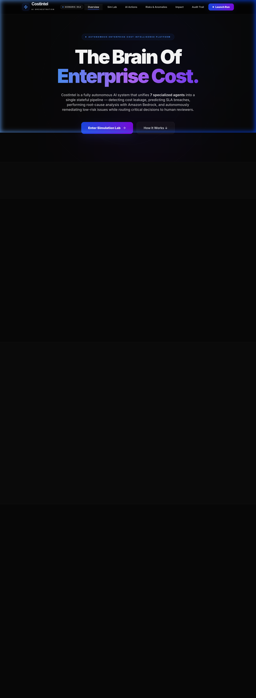
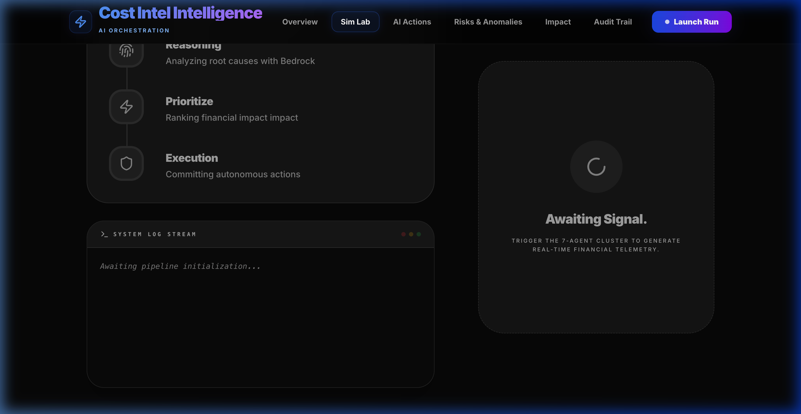
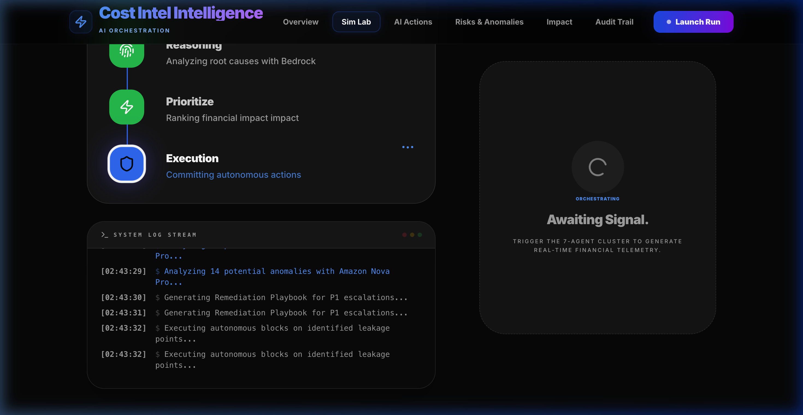
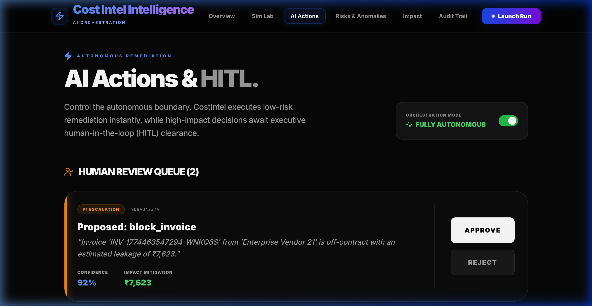
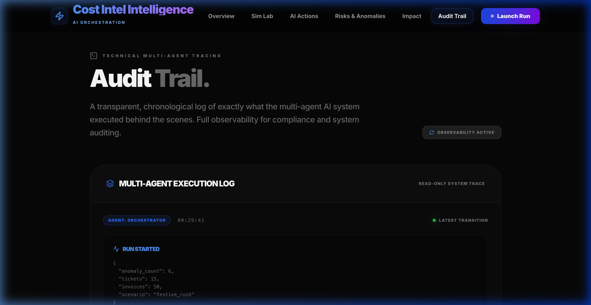
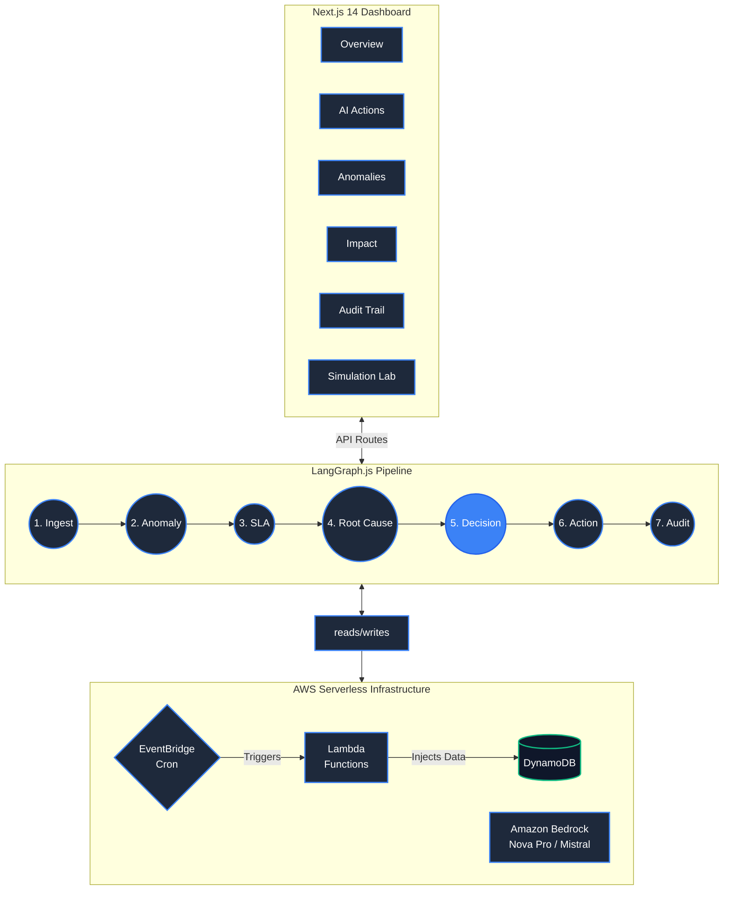
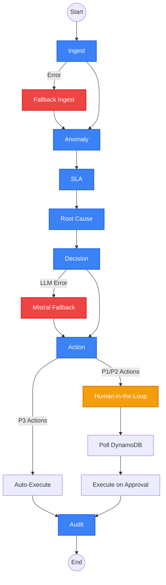
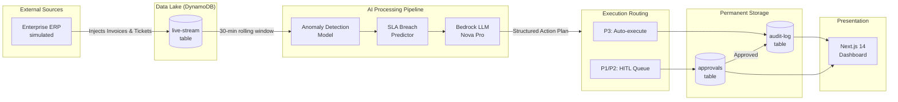
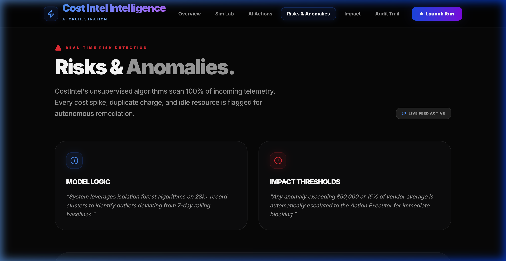
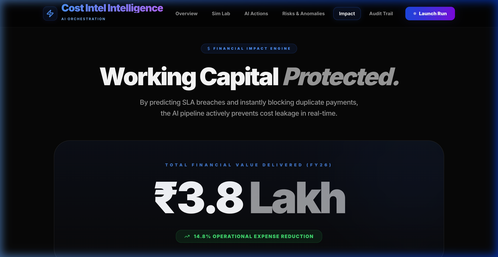

<div align="center">
  <h1>⚡ CostIntel</h1>
  <p><b>Enterprise Cost Intelligence & Autonomous Action</b></p>
  <p><i>A 7-agent AI pipeline that watches enterprise finances 24/7, catches cost leakage before money leaves, and acts autonomously — with a human always in the loop for high-stakes decisions.</i></p>

  [](https://www.typescriptlang.org/)
  [](https://nextjs.org/)
  [](https://aws.amazon.com/bedrock/)
  [](https://aws.amazon.com/dynamodb/)
  [](https://langchain-ai.github.io/langgraphjs/)
  [](LICENSE)

</div>

<br />

> 📸 **Dashboard Overview:** Executive Summary with live metrics.
> 

## Table of Contents

- [The Problem — Why This Exists](#the-problem--why-this-exists)
- [What CostIntel Does — Solution Overview](#what-costintel-does--solution-overview)
- [Key Features — Full Feature List](#key-features--full-feature-list)
- [Architecture — Full System Architecture](#architecture--full-system-architecture)
- [The 7-Agent Pipeline — Deep Dive](#the-7-agent-pipeline--deep-dive)
- [Data Flow Diagram (DFD)](#data-flow-diagram-dfd)
- [Tech Stack — Full Table](#tech-stack--full-table)
- [Project File Structure](#project-file-structure)
- [Simulation Scenarios](#simulation-scenarios)
- [AWS Infrastructure](#aws-infrastructure)
- [The Prototype vs. Full Production System](#the-prototype-vs-full-production-system)
- [The Financial Impact Model](#the-financial-impact-model)
- [Setup & Installation](#setup--installation)
- [Environment Variables Reference](#environment-variables-reference)
- [Dashboard Pages](#dashboard-pages)
- [API Reference](#api-reference)
- [How to Add a New Scenario](#how-to-add-a-new-scenario)
- [Judging Criteria Alignment](#judging-criteria-alignment)
- [Contributing & License](#contributing--license)
- [Acknowledgements](#acknowledgements)

---

## The Problem — Why This Exists

Imagine you are the CFO of an Indian enterprise processing `₹500 Crore` in annual procurement spend. Your finance team reviews invoices manually — thousands of them every month. They check for duplicate charges, compare vendor billing against contract rates, and flag anything suspicious. On a good day, they catch about 60% of the anomalies. But here is the problem: **by the time a human analyst spots a duplicate payment or an off-contract charge, the money has already left your account — typically 2 to 4 weeks ago.** 

The leakage is silent, continuous, and compounding.

Industry data shows that Indian enterprises lose between **5% to 8%** of their annual procurement spend to undetected cost leakage. This includes duplicate invoice submissions, off-contract billing, idle cloud infrastructure, and maverick spending. On a `₹500 Crore` budget, 5% leakage translates to **₹25 Crore per year walking out silently**.

Additionally, SLA breaches carry automatic penalty clauses — typically `₹25,000 to ₹1,00,000` per incident. Most SLA breaches are entirely predictable based on ticket volume, capacity, and vendor history. Yet no team prevents them proactively because there is no tool that combines real-time ticket analysis with predictive statistical modelling.

> **The Critical Gap:** No existing tool combines anomaly detection + SLA breach prediction + autonomous corrective action + full audit trail in a single unified pipeline. CostIntel unifies these capabilities into an AI-orchestrated system that runs continuously, acts autonomously on low-risk issues, and holds high-impact decisions for human review.

---

## What Cost Intel Intelligence Does — Solution Overview

Cost Intel Intelligence is an autonomous AI agent system. It is not just a dashboard showing charts; it is an active participant in your enterprise finance operations that detects problems, reasons about causes, takes corrective action, and writes a complete audit trail in under **3 seconds** per execution cycle.

1. **Ingests Data:** Continuously reads procurement invoices and SLA tickets from a DynamoDB stream (mocking a live ERP feed like SAP or Oracle).
2. **Detects Anomalies:** Scans 100% of transactions through a statistical isolation algorithm to identify pricing outliers, duplicates, and off-contract billing.
3. **Predicts Breaches:** Forecasts which SLA tickets will breach their deadline before it happens using capacity and volume metrics.
4. **Reasons & Synthesizes:** Passes findings to Amazon Bedrock's Nova Pro LLM, which synthesizes the raw data into a structured action plan.
5. **Executes Autonomously:** Executes routine P3 actions (vendor blocks, payment holds) instantly.
6. **Requires Human Approval:** Routes critical P1 and P2 actions to a human-in-the-loop approval queue.
7. **Maintains Compliance:** Logs every single decision to an immutable DynamoDB audit trail.

> 📸 **Live Activity Feed:** Dynamic timeline showing agent events in real-time.
> 

---

## Key Features — Full Feature List

### 1. 7-Agent LangGraph.js Pipeline
The core of Cost Intel Intelligence is a stateful multi-agent pipeline: `Ingest → Anomaly → SLA → RootCause → Decision → Action → Audit`. Each agent has a single, testable responsibility. LangGraph.js manages a persistent, typed state object that flows through every node, giving the final Audit agent full visibility into what every upstream agent decided and why.

### 2. Dynamic Simulation Engine
Ships with 6 named enterprise scenarios (`normal`, `vendor_spike`, `sla_crisis`, `audit_crunch`, `post_merger`, `festive_rush`). Scenarios control anomaly rates, spike multipliers, and team capacity. The simulator uses zero fixed seeds and has a 20% burst event probability — mimicking real-world clusters of anomalies like compromised vendor accounts. 

> 📸 **Simulation Lab:** Real-time pipeline execution and logging.
> 

### 3. Amazon Bedrock Reasoning (Nova Pro + Mistral Fallback)
The Decision Agent uses `amazon.nova-pro-v1:0` via the Bedrock Converse API to synthesize ML findings into a structured JSON action plan. If Nova Pro fails (timeout, rate limit), the pipeline automatically falls back to `mistral.mistral-large-2402-v1:0` using the `[INST]` prompt format. **The pipeline never halts.**

### 4. Statistical Anomaly Detection
Uses statistical methods inspired by Isolation Forest principles. Detects three types of anomalies: `spike`, `off-contract`, and `duplicate_timing`. Each anomaly receives a dynamic severity score and an estimated INR leakage value.

### 5. SLA Breach Prediction
Performs statistical breach prediction combining metrics like team capacity, current ticket volume, time-of-day, and ticket priority. Calculates a breach probability for every open ticket, shifting from a reactive "pay the penalty" model to a proactive "reassign to prevent penalty" stance.

### 6. Human-in-the-Loop (HITL) Workflow
Implements a three-tier priority system:
* **P1:** Critical (over ₹5L) — Immediate human review.
* **P2:** Significant (₹1L–₹5L) — Human review within 24h.
* **P3:** Routine (under ₹1L) — Auto-executes instantly.

> 📸 **AI Actions Page:** Pending P1 approvals and executed actions.
> 

### 7. Immutable Audit Trail
Every pipeline run and agent decision is written to the `costintel-audit-log` DynamoDB table containing the `run_id`, agent name, full JSON payload, and timestamps. This satisfies enterprise compliance and regulatory examinations.

> 📸 **Technical Audit Trail:** Expandable traces for every pipeline run.
> 

### 8. Serverless AWS Infrastructure
Fully serverless AWS stack running in `ap-south-1` (Mumbai) for low latency. Uses DynamoDB (`PAY_PER_REQUEST` + TTLs), EventBridge, and Lambda functions. 

---

## Architecture — Full System Architecture

Cost Intel Intelligence follows a clean separation between the **presentation layer** (Next.js 14 Dashboard), the **intelligence layer** (LangGraph.js Pipeline + Bedrock), and the **persistence layer** (DynamoDB).



---

## The 7-Agent Pipeline — Deep Dive

Each agent in the Cost Intel Intelligence pipeline is a pure function that updates a shared LangGraph state block. 

| Agent | Responsibility | Input | Output | Failure Mode |
|---|---|---|---|---|
| **INGEST** | Reads live window from DynamoDB stream table | `window_minutes` config | Raw invoices + tickets arrays | Falls back to last successful window |
| **ANOMALY** | Runs statistical detection across all invoices | Raw invoices | Anomaly findings + severity factors | Rule-based fallback (3× vendor average) |
| **SLA** | Predicts breach probability for open tickets | Raw tickets | Breach risk list + penalty amounts | Rule-based fallback (capacity × volume threshold) |
| **ROOT_CAUSE** | Classifies anomalies | Anomaly findings | Classified findings (spike/off-contract) | Uses top severity factor |
| **DECISION** | Synthesizes action plan via Amazon Nova Pro | All findings | JSON action plan (P1/P2/P3) | **Mistral Large Fallback** |
| **ACTION** | Routes P3 to auto-execute, P1/P2 to DB | Action plan | Executed actions + pending queue | Logs failure, continues pipeline |
| **AUDIT** | Writes complete immutable event record | Full run state | Immutable audit entry | Retries 3× before failure |

### LangGraph State Machine Flow



---

## Data Flow Diagram (DFD)



---

## Tech Stack — Full Table

| Layer | Technology | Version | Why This Choice |
|---|---|---|---|
| Frontend Framework | Next.js | 14.2.15 | App Router, Server Components, API routes in one repo |
| Language | TypeScript | 5.x | Type safety across agents, state, and AWS SDK calls |
| UI Components | React | 18.3 | Concurrent rendering for live feed updates |
| Animations | Framer Motion | 11.11 | Smooth metric transitions during live pipeline runs |
| Charts | Recharts | 2.13 | Financial waterfall and time-series charts |
| Styling | Tailwind CSS | 3.4 | Utility-first, dark theme, rapid iteration |
| Agent Orchestration | LangGraph.js | 0.2.19 | Stateful multi-agent graphs with conditional routing |
| LLM Reasoning | Amazon Bedrock Nova Pro | v1:0 | Best-in-class reasoning for structured JSON output |
| LLM Fallback | Amazon Bedrock Mistral Large | 2402-v1:0 | Automatic failover — pipeline never stops |
| Database | AWS DynamoDB | SDK v3 | Serverless, pay-per-request, TTL for auto-cleanup |
| Mock Data | @faker-js/faker | 9.2 | Realistic Indian enterprise names and patterns |
| Localisation | Intl.NumberFormat | ES | `en-IN` formatting (`formatINR`) for Rupee displays |

---

## Project File Structure

```text
Cost-Intel-Intelligence/
├── src/                              # Main application source code
│   ├── app/                          # Next.js 14 App Router routes
│   │   ├── layout.tsx                # Root layout / GlobalNav wrapper
│   │   ├── page.tsx                  # / — Full Overview dashboard
│   │   ├── simulation/page.tsx       # /simulation — Sim Lab pipeline trigger
│   │   ├── actions/page.tsx          # /actions — Execution & HITL actions
│   │   ├── anomalies/page.tsx        # /anomalies — Risks & Analysis feed
│   │   ├── sla/page.tsx              # /sla — Impact / Working Capital page
│   │   ├── audit/page.tsx            # /audit — Technical trace logging
│   │   └── api/                      # Next.js specific serverless API routes
│   │       ├── pipeline/route.ts     # Triggers AI simulation + LangGraph agents
│   │       ├── approve/route.ts      # HITL approval mechanics
│   │       ├── runs/route.ts         # Pipeline execution history
│   │       ├── metrics/[id]/route.ts # Mathematical KPIs
│   │       ├── audit/[id]/route.ts   # Deep trace retrieval
│   │       └── status/route.ts       # Live system polling
│   │
│   ├── components/                   # React UI presentational components
│   │   └── GlobalNav.tsx             # Navbar with gradient branding
│   │
│   ├── ai_agents/                    # LangGraph.js pipeline logic
│   │   ├── orchestrator.ts           # Wires the graph and conditional routing
│   │   ├── state.ts                  # Shared pipeline state schema
│   │   └── nodes.ts                  # Logic for all 7 independent agents
│   │
│   ├── synthetic_data_engine/
│   │   └── simulator.ts              # 6-scenario engine driving data streams
│   │
│   ├── aws/                          # AWS integrations
│   │   ├── config.ts                 # Resource configurations
│   │   ├── dynamo.ts                 # Database wrappers
│   │   ├── bedrock.ts                # Dual-model LLM abstraction
│   │   └── deploy/
│   │       └── create_tables.ts      # Instantiates DynamoDB tables
│   │
│   └── lib/                          # App utilities
│       └── formatINR.ts              # Financial presentation logic
│
├── docs/screenshots/                 # README demonstration imagery
├── .env.example                      # Environment variables template
├── next.config.js                    # Next.js routing and build config
├── package.json                      # NPM dependencies and scripts
├── tailwind.config.js                # Tailwind CSS styling and theme
└── tsconfig.json                     # TypeScript compiler configuration
```

---

## Simulation Scenarios

The active scenario is chosen purely dynamically per run to stress-test the pipeline under different enterprise stressors. 

| Scenario | Description | Anomaly Rate | Breach Rate | Team Capacity | Spike Multiplier |
|---|---|---|---|---|---|
| `normal` | Routine week, low risk. Validates baseline operations. | 4% | 20% | 80% | 3–6× |
| `vendor_spike` | IT and SaaS vendors overbilling. Tests cloud cost surges. | 12% | 28% | 75% | 5–15× |
| `sla_crisis` | Monday morning ticket surge understaffing test. | 3% | 55% | 45% | 2–5× |
| `audit_crunch` | Month-end bulk duplicate resubmissions test. | 9% | 35% | 70% | 2–4× |
| `post_merger` | Integration chaos. Unmapped vendor contract testing. | 15% | 42% | 60% | 4–10× |
| `festive_rush` | Bulk sequence masking legitimate anomalies. High volume. | 7% | 48% | 55% | 6–20× |

> 📸 **Anomalies Detection Module:** Intelligent risk tracking mapped to scenario inputs.
> 

---

## AWS Infrastructure

### DynamoDB Tables
1. `costintel-live-stream` — **TTL: 24h**. Rolling window of simulated ERP invoices and tickets.
2. `costintel-audit-log` — **TTL: None**. Permanent immutable system event tracing ledger.
3. `costintel-approvals` — **TTL: 48h**. Temporary persistence for pending & reviewed HITL decisions.

### Bedrock Calling Strategy
The `Bedrock Converse API` is utilized natively for Nova Pro to take advantage of its excellent structural adherence and reasoning logic. If restricted or timed out, the `InvokeModel API` intercepts the traffic via a generic text-generation prompt designed specifically to wrap structural constraints onto Mistral Large models, keeping the pipeline unbroken.

---

## The Prototype vs. Full Production System

| Dimension | Hackathon Prototype | Full Production System |
|---|---|---|
| **Data Source** | Simulator Engine (6 distinct scenarios) | SAP / Oracle ERP webhooks & batch streams |
| **Ticket Source** | Synthesized statistical service tickets | ServiceNow / Jira dynamic API ingestion |
| **Detection** | Isolation-inspired heuristic scoring algorithms | Fine-tuned Isolation Forest + XGBoost ensembles |
| **Reasoning** | Unified AWS Bedrock foundation | Same + Private domain-adapted LLM checkpoints |
| **Approval Interops** | Built-in React HITL dashboard | Slack / Microsoft Teams contextual actionable messaging |
| **Audit Trails** | Append-based DynamoDB runs table | SOC-2 compliant cryptographically signed ledgers |
| **Integrations** | Internal simulation of blocks & controls | Active ERP intervention (SAP AP Hold / Block triggers) |

---

## The Financial Impact Model

We model our impact projection using conservative figures tied to a fictional but completely standard mid-cap Indian corporation.

```text
================================================================
IMPACT CALCULATION FOR A ₹500 CRORE PROCUREMENT BUDGET
================================================================

Assumption 1: Industry Leakage
  ₹500 Cr × 5% = ₹25 Crore estimated cost leakage annually

Assumption 2: CostIntel Recovery Rate
  ₹25 Cr × 85% conservative mitigation = ₹21.25 Crore

Assumption 3: SLA Penalty Protections
  1,000 tickets/month × 8% breach probability × ₹50,000 avg penalty
  = ₹40 Lakh/month = ₹4.8 Cr/year penalty risk
  Cost Intel Intelligence proactive intervention at 70% success = ₹3.36 Crore savings

TOTAL ANNUAL ENTERPRISE VALUE DELIVERED: ₹24.61 Crore Return
================================================================
```

> 📸 **Working Capital Protected:** Real-time demonstration of value creation.
> 

---

## Setup & Installation

**Prerequisites:** Node.js 20.x, an AWS Account (Bedrock Models enabled in `ap-south-1`).

```bash
# 1. Clone & Install
git clone https://github.com/adarshcod30/Cost-Intel-Intelligence.git
cd Cost-Intel-Intelligence
npm install

# 2. Configure Environment
cp .env.example .env
# Edit .env and supply your AWS_ACCESS_KEY_ID & AWS_SECRET_ACCESS_KEY

# 3. Provision AWS Tables (creates Stream, Audit & Approvals DynamoDB instances)
npx ts-node src/aws/deploy/create_tables.ts

# 4. Enable Models
# Access AWS Console -> Bedrock -> Model Access -> Enable:
# - Amazon Nova Pro (amazon.nova-pro-v1:0)
# - Mistral Large (mistral.mistral-large-2402-v1:0)

# 5. Boot Up
npm run dev
# Accessible at http://localhost:3000
```

---

## Environment Variables Reference

| Variable | Requirement | Description |
|---|---|---|
| `AWS_ACCESS_KEY_ID` | **Required** | IAM Identity Access Key |
| `AWS_SECRET_ACCESS_KEY` | **Required** | IAM Identity Secret Token |
| `AWS_REGION` | **Required** | Base AWS Region (Targeting `ap-south-1`) |
| `DYNAMO_STREAM_TABLE` | Optional | Override for: `costintel-live-stream` |
| `DYNAMO_AUDIT_TABLE` | Optional | Override for: `costintel-audit-log` |
| `DYNAMO_APPROVAL_TABLE` | Optional | Override for: `costintel-approvals` |

---

## Dashboards & APIs

### Key Page Routes
- `/`: The cinematic narrative overview.
- `/simulation`: Execution lab to manually trace agent activities and stream statuses.
- `/actions`: Prioritization routing desk. Houses the interactive HITL (Human-in-the-Loop) interfaces for P1/P2 approvals.
- `/anomalies`: Detection feed listing items mapped accurately back to standard operational processes.
- `/sla`: Enterprise value tracking engine calculating running returns on the infrastructure deployment.
- `/audit`: Security-led technical tracing ledger pulling immutable histories from DynamoDB.

### Full API Reference

| Endpoint | Method | Input Parameters | Return Scope |
|---|---|---|---|
| `/api/pipeline` | POST | None | Dispatches Simulation & 7-Agent Invocation |
| `/api/approve` | GET | None | Reads & enumerates uncompleted P1/P2 actions |
| `/api/approve` | POST | `action_id`, `run_id`, `decision` | Commits approval back to DynamoDB records |
| `/api/runs` | GET | None | Reads historical array of agent deployments |
| `/api/metrics/[id]` | GET | `id: string` | Aggregates mathematical impact per sequence |
| `/api/audit/[id]` | GET | `id: string` | Exposes serialized states per step within run |
| `/api/status` | GET | None | Serves live operational and polling metrics |

---

## How to Add a New Scenario

Extend testing coverage via the simulation engine effortlessly:

```typescript
// Open src/synthetic_data_engine/simulator.ts
export const SCENARIOS = {
  // Add an custom behavior profile context
  fiscal_year_close: {
    anomalyRate:     0.18,   // High pressure risk spikes
    spikeMultiplier: [2, 7], // Moderate rate inflation 
    breachRate:      0.22,   // Stabilized service impacts
    teamCapacity:    0.95,   // Elevated manpower deployment
    ticketVolume:    45,     // Extreme operations volume
  },
};
```
The architecture natively folds this context into detection baselines without additional scaling work.

---

## Contributing & License

We love to collaborate on extending this framework further. Contributions standard via fork & pull request branches alongside accompanying testing.

### MIT License
This software is provided "AS IS", completely open-sourced to encourage iterative optimization against the complex nature of cost leakages. 

---

## Acknowledgements

* **Developed by Adarsh Dwivedi**
  * 📱 +91 9305597756
  * 💻 [GitHub Profile](https://github.com/adarshcod30)
  * 🔗 [LinkedIn Profile](https://www.linkedin.com/in/adarshdwivedi30)
  * *Adarsh is a passionate software engineer specializing in AI-driven enterprise applications and full-stack development. By integrating sophisticated large language models with reliable backend architectures, he focuses on building scalable autonomous systems that solve real-world problems.*
* **AWS Bedrock** for unlocking advanced programmatic reasoning mechanics at minimal latencies.
* **LangChain** for `LangGraph.js` making stateful routing structurally sustainable.

<br />
<div align="center">
  <b>Architected by Adarsh Dwivedi — Cost Intel Intelligence</b>
</div>
